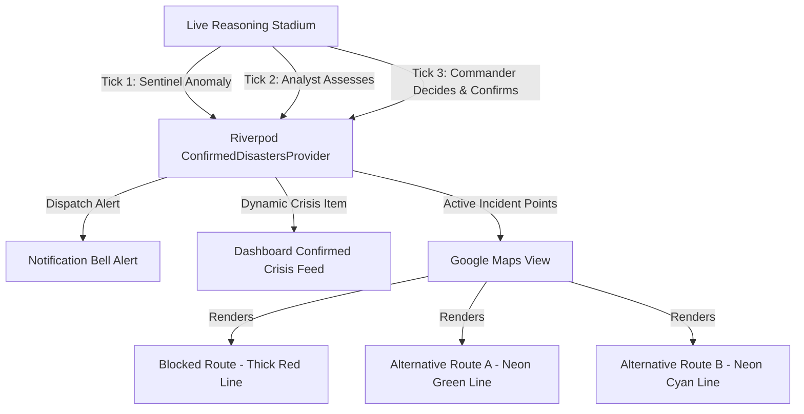

# Implementation Plan — Confirmed Disasters Notifications & Dynamic Routing

This plan details the addition of a cohesive Notification Center and an advanced dynamic routing layout for emergency dispatch on Google Maps, coordinated via a Riverpod state notifier system.

## 🎨 Architectural Overview

## 🛠️ Detailed File Implementations

### 1. State Management & State Notifications

#### [NEW] [confirmed_disasters_provider.dart](file:///d:/Side%20Projects/CIRO/mobile/lib/widgets/confirmed_disasters_provider.dart)
A Riverpod provider to hold list of confirmed disasters, each containing:
- `id`: unique ID.
- `title`: Name of the incident (e.g., G-10 Flash Flood).
- `type`: Crisis category.
- `location`: Human-readable neighborhood description.
- `latLng`: Geolocation.
- `confidenceScore`: Sentiment confidence level (e.g. 96%).
- `severity`: Standard numerical index (1-5).
- `status`: Lifecycle (Sentinel, Analyst, Commander, Dispatched).
- `blockedPoints`: Coordinates describing the blocked road segments.
- `alternativeRoutes`: Coordinates, titles, and travel times for detours.

### 2. UI Modules

#### [MODIFY] [live_reasoning_stadium.dart](file:///d:/Side%20Projects/CIRO/mobile/lib/widgets/live_reasoning_stadium.dart)
- Read and write to `confirmedDisastersProvider`.
- As the mock AI loop triggers:
  - T1: Post a pending Sentinel triage entry.
  - T2: Promote to an Analyst-assessed situation.
  - T3: Trigger a final Commander action, confirm the disaster, and add it to the verified database.

#### [NEW] [confirmed_disasters_feed.dart](file:///d:/Side%20Projects/CIRO/mobile/lib/widgets/confirmed_disasters_feed.dart)
- Renders as a vertical panel below the stadium.
- Displays confirmed crisis items with exact geolocation details, confidence values, and live action trackers.

#### [MODIFY] [main_navigation.dart](file:///d:/Side%20Projects/CIRO/mobile/lib/screens/main_navigation.dart)
- Taps into the Riverpod state to display a glowing warning badge on the Notification Bell when a disaster is confirmed.
- Opens a beautiful glassmorphism Notification Drawer showing all confirmed crisis cards.

### 3. Dynamic Map Routing

#### [MODIFY] [map_screen.dart](file:///d:/Side%20Projects/CIRO/mobile/lib/screens/map_screen.dart)
- Reads the active disaster's routing coordinates.
- Plots a thick, high-contrast Red Polyline (`color: Colors.redAccent`) to represent the exact road segment that is closed/flooded/blocked.
- Plots Alternative Detours in Neon Green and Neon Cyan.
- Adds an overlay drawer allowing the commander to toggle specific routes, view estimated arrival times, and tap to select the preferred detour route.
