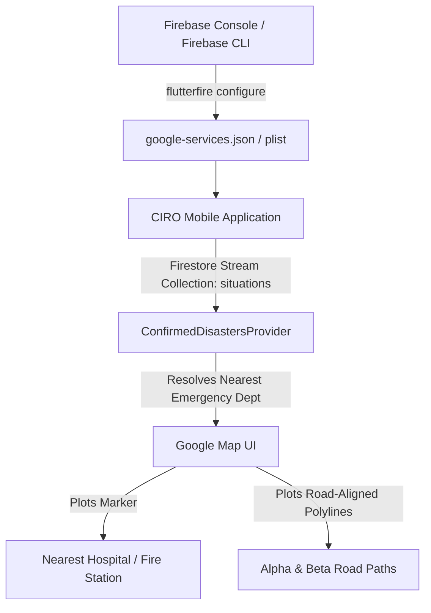

# Implementation Plan — Live Firebase Integration & Road-Aligned Emergency Routing

This plan outlines how we will connect the CIRO mobile application to a live Firebase Firestore database and correct the Google Maps routing coordinates so they follow actual roads from the nearest Emergency Department (hospital/fire station) to the disaster zone in Islamabad and Karachi.

## 🎨 Architectural Overview

## 🛠️ Proposed Changes

### 1. Mobile State Management & Live Firestore listener

#### [MODIFY] [confirmed_disasters_provider.dart](file:///d:/Side%20Projects/CIRO/mobile/lib/widgets/confirmed_disasters_provider.dart)
- Add fields to `ConfirmedDisaster`:
  - `emergencyDeptName` (String): Name of the closest emergency response hub (e.g. PIMS Hospital).
  - `emergencyDeptLatLng` (LatLng): Precise coordinates of the hospital or fire station.
- Refactor `generateMockDisaster` to return high-fidelity, road-aligned coordinates that follow major sectors, Srinagar Highway, Ibn-e-Sina Road, and Sumbal Road in Islamabad, and South City / Marine Promenade roads in Karachi.
- Implement `listenToFirestore()` inside `ConfirmedDisastersNotifier` using `FirebaseFirestore.instance.collection('situations')`:
  - Listen in real-time to the database updates.
  - Automatically parse incoming situations (e.g., from the multi-agent reasoning backend) and populate the state.
  - Wrap Firestore initialization in a robust try-catch block to gracefully fall back to the offline simulator if the user has not configured their Firebase credentials.

### 2. Map Interface Overhaul

#### [MODIFY] [map_screen.dart](file:///d:/Side%20Projects/CIRO/mobile/lib/screens/map_screen.dart)
- Read the active disaster's `emergencyDeptLatLng` and `emergencyDeptName`.
- Render a new high-contrast glowing Cyan/Red marker for the **Emergency Department**.
- Correct the map viewport bounds to automatically enclose **both** the disaster coordinate and the hospital coordinate so the dispatch path is immediately visible.
- Render the blockades and alternative detour polylines along the actual road vectors rather than drawing raw diagonal cutlines through building grids.

### 3. Application Initialization

#### [MODIFY] [main.dart](file:///d:/Side%20Projects/CIRO/mobile/lib/main.dart)
- Import `firebase_core`.
- In `main()`, initialize Firebase within a try-catch block to prevent crash loops when running in offline/mock configurations.
- Trigger the Firestore listener on app boot.

#### [MODIFY] [live_reasoning_stadium.dart](file:///d:/Side%20Projects/CIRO/mobile/lib/widgets/live_reasoning_stadium.dart)
- Update mock simulation triggers to align with the high-fidelity routing coordinates for Islamabad and Karachi so that both the mock and live modes are completely synchronized.

## 🏁 Verification Plan

### Automated Tests
- Run `flutter analyze` to verify correct imports, types, and compiler compatibility.
- Ensure the app compiles successfully for Android.

### Manual Verification
- Deploy the updated app onto the Vivo V40 device.
- Open the maps tab and trigger the disaster scenario to verify:
  1. The Emergency Department marker renders at PIMS Hospital.
  2. The polylines follow Kashmir Highway, Ibn-e-Sina Road, and G-10 avenues without cutting through buildings.
  3. Verify Firebase connection guide details are fully presented to the user.
